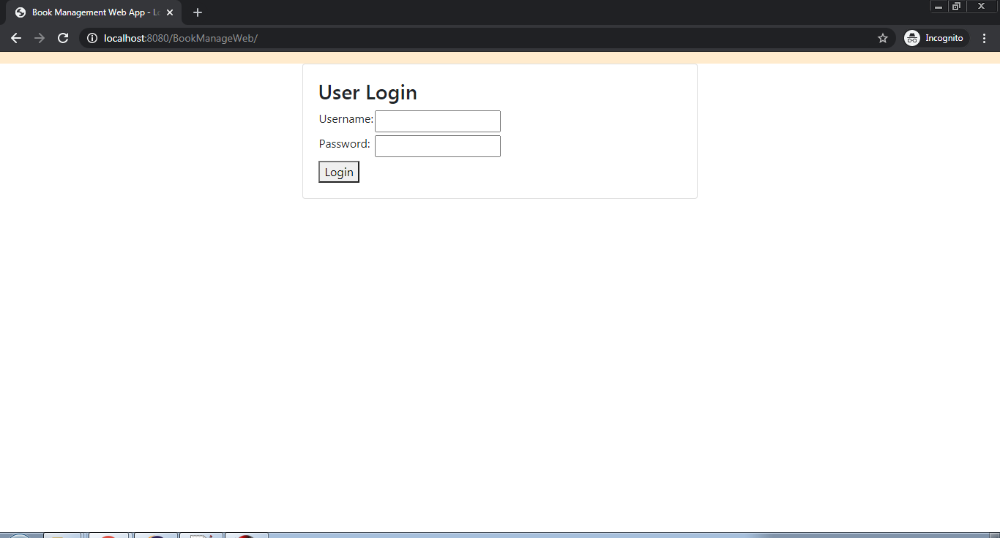
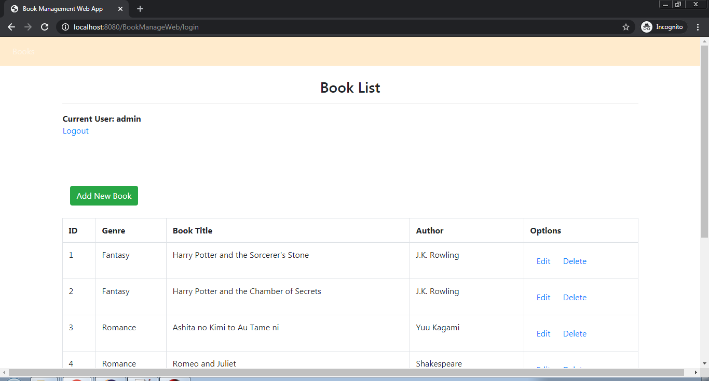
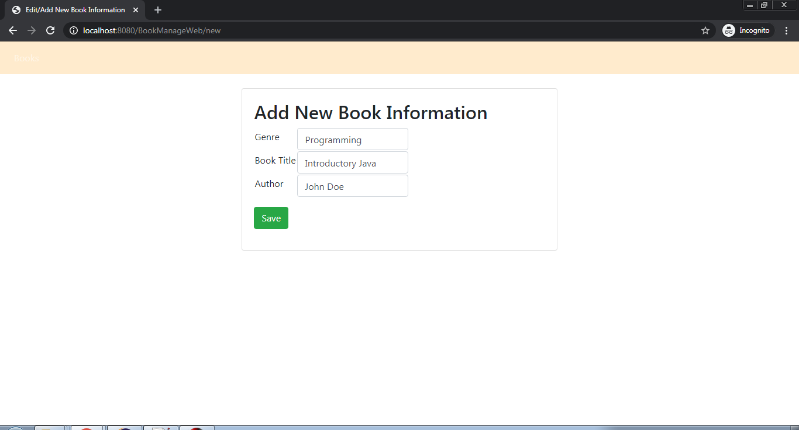

# BookManageWeb
A simple web application made in Java using JSP, Tomcat Server as DB with MySQL queries

---

|Requirements/Dependencies|
|----------------------|
|jsp-api-2.2.jar|
|jstl-1.2.jar|
|mysql-connection-java-8.0.13.jar|
|servlet-api-2.5.jar|
|Tomcat Server v8.5|

---

Sample Screenshots:

Login Screen

Book List Management Screen

Add/Edit Book Information Screen

